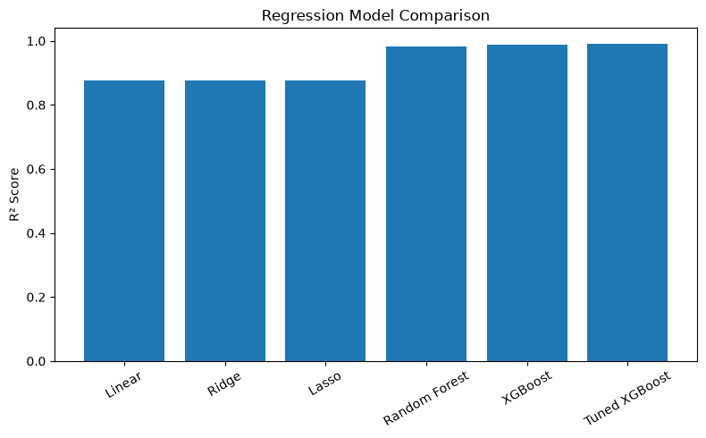
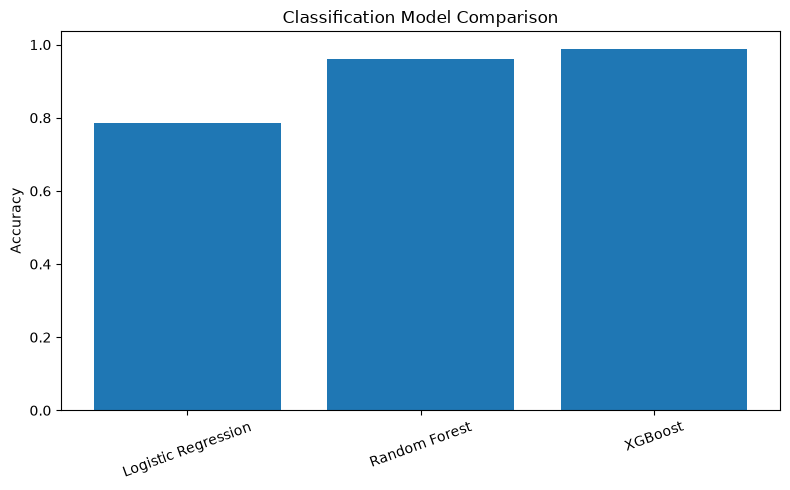
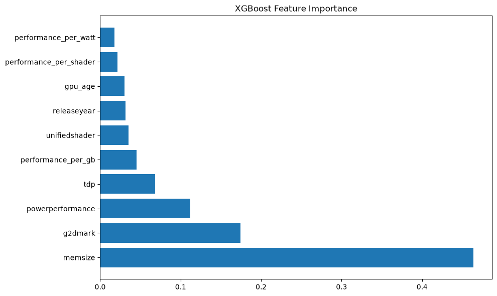

# NVIDIA GPU Performance Analytics & Machine Learning

## Project Overview

This project analyzes NVIDIA GPU performance data and builds Machine Learning models to:

1. Predict GPU benchmark performance (G3DMark)
2. Classify GPUs into performance categories

The project follows a complete Data Science and Machine Learning workflow including:

- Data Collection
- Data Cleaning
- Exploratory Data Analysis (EDA)
- Statistical Analysis
- Feature Engineering
- Feature Selection
- Regression Modeling
- Classification Modeling
- Hyperparameter Tuning
- Model Deployment Pipeline

---

## Problem Statement

Modern GPUs contain multiple hardware specifications such as memory size, shader count, clock speeds, power consumption, and benchmark scores.

The objective is to understand how these specifications influence GPU performance and build predictive models capable of estimating performance for unseen GPUs.

---

## Dataset

Dataset Used:

- feature_engineered_gpu_dataset.csv

Key Features:

- manufacturer
- releaseyear
- memsize
- gpuclock
- memclock
- unifiedshader
- tmu
- rop
- g3dmark
- g2dmark
- price
- gpuvalue
- tdp
- powerperformance
- opencl
- performance_per_watt
- performance_per_gb
- performance_per_shader
- gpu_age
- performance_category

---

## Project Workflow

### 1. Data Preprocessing

Performed:

- Missing Value Handling
- Data Cleaning
- Feature Transformation
- Dataset Preparation

---

### 2. Feature Engineering

Created:

- GPU Age
- Performance per Watt
- Performance per GB
- Performance per Shader

---

### 3. Feature Selection

Methods Used:

- Correlation Analysis
- Mutual Information
- Random Forest Feature Importance
- Recursive Feature Elimination (RFE)

Selected Features:

- releaseyear
- memsize
- unifiedshader
- g2dmark
- tdp
- powerperformance
- performance_per_watt
- performance_per_gb
- performance_per_shader
- gpu_age

---

## Regression Task

### Target

G3DMark

### Models Evaluated

| Model | R² Score |
|---------|---------|
| Linear Regression | 0.8775 |
| Ridge Regression | 0.8774 |
| Lasso Regression | 0.8774 |
| Random Forest Regressor | 0.9835 |
| XGBoost Regressor | 0.9880 |
| Tuned XGBoost Regressor | 0.9905 |

### Best Regression Model

Tuned XGBoost Regressor

Performance:

- R² Score: 0.9905
- MAE: 191.37
- RMSE: 436.56

---

## Classification Task

### Target

performance_category

### Models Evaluated

| Model | Accuracy |
|---------|---------|
| Logistic Regression | 78.54% |
| Random Forest Classifier | 96.14% |
| XGBoost Classifier | 98.71% |

### Best Classification Model

XGBoost Classifier

Performance:

- Accuracy: 98.71%
- Precision: 98.73%
- Recall: 98.71%
- F1 Score: 98.71%

---

## Hyperparameter Tuning

Technique Used:

- RandomizedSearchCV

Regression Best Parameters:

```python
{
    'subsample': 0.7,
    'n_estimators': 500,
    'max_depth': 3,
    'learning_rate': 0.1,
    'colsample_bytree': 0.8
}
```

Classification Best Parameters:

```python
{
    'subsample': 0.9,
    'n_estimators': 200,
    'max_depth': 8,
    'learning_rate': 0.1,
    'colsample_bytree': 0.8
}
```

---

## Project Structure

```text
gpu-performance-analytics-ml/

├── data/
├── notebooks/
│   ├── 01_data_understanding.ipynb
│   ├── 02_preprocessing.ipynb
│   ├── 03_feature_selection.ipynb
│   ├── 04_regression_models.ipynb
│   ├── 05_regression_tuning.ipynb
│   ├── 06_classification_models.ipynb
│   └── 07_classification_tuning.ipynb
│
├── models/
│   ├── best_regression_model.pkl
│   ├── best_classification_model.pkl
│   ├── regression_features.pkl
│   ├── classification_features.pkl
│   └── performance_category_encoder.pkl
│
├── src/
│   └── predict.py
│
├── requirements.txt
├── README.md
└── .gitignore
```

---

## Running Predictions

```bash
python src/predict.py
```

Example Output:

```text
Predicted G3DMark: 23475.42
Predicted Performance Category: Low
```

---

## Technologies Used

- Python
- Pandas
- NumPy
- Matplotlib
- Scikit-Learn
- XGBoost
- Joblib
- Jupyter Notebook

---

## Results

### Regression Model Comparison



### Classification Model Comparison



### Feature Importance



---

## Future Improvements

- Streamlit Web Application
- Real-Time GPU Comparison Dashboard
- Model Deployment on Cloud
- GPU Recommendation System

---

## Author

G N Bhuvaneshwaran

B.Tech Computer Science and Engineering

Amrita Vishwa Vidyapeetham